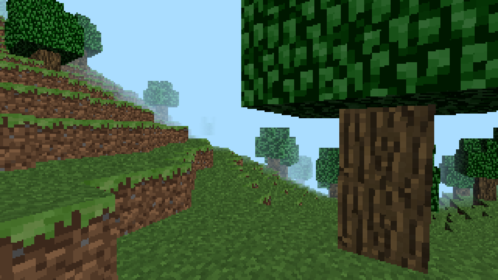
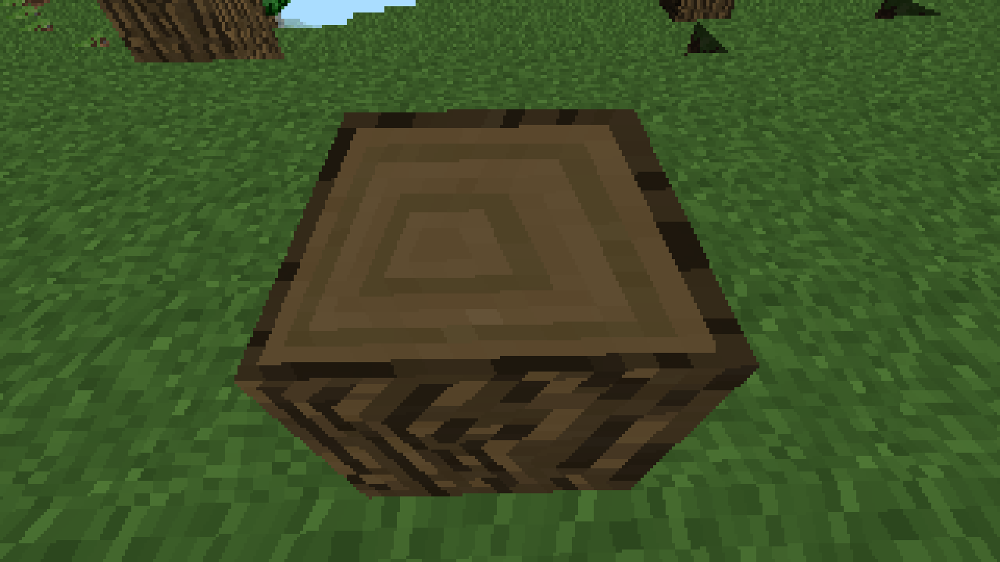
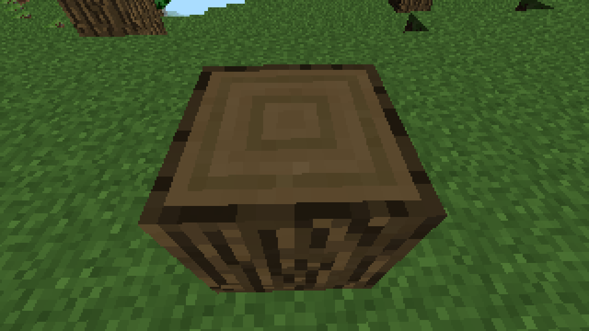

# Software rendered Minecraft Clone

My little Minecraft Clone using my own Software Renderer.

### Features

- Procedural Terrain generation in Chunks
- very simple (and a bit buggy) collision detection
- breaking blocks
- placing blocks (only stone for now)
- Saving on Close
- Loading on Start
- Toggling between Affine and Perspective-Corrected Texture Mapping (Keyboard _P_)

### Affine Texture Mapping

### Perspective-Correct Texture Mapping

## Setup

Import Folder "MinecraftClone" into Eclipse (File > Import... > General/Existing Projects into Workspace).
Run MinecraftClone / src / game / Main.java